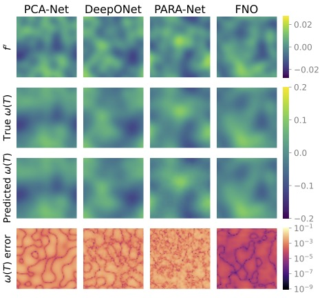
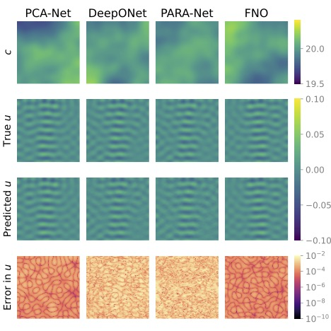
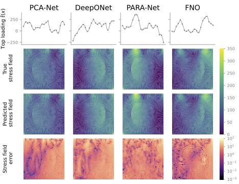
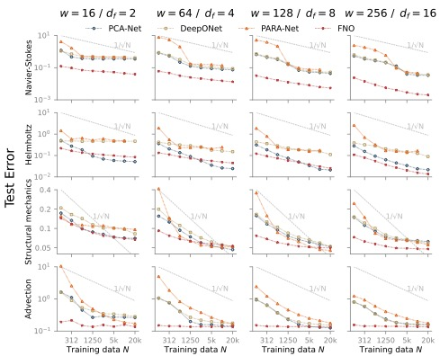
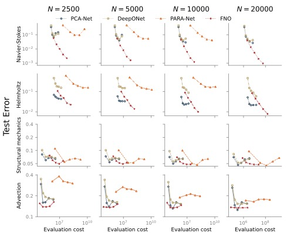

#  Cost-Accuracy Trade-off in Operator Learning With Neural Networks

This work is motivated by successes in using neural networks to approximate nonlinear maps in computational science and engineering. In principle, the relative merits of these neural networks can be evaluated by understanding, for each one, the
cost required to achieve a given level of accuracy. Understanding the trade-off between cost and accuracy, for different neural
operators, and in different parameter/data regimes, is thus of central importance in guiding how this field
develops; it forms the focus of this work.

We consider four neural operators `PCA-Net`,  `DeepONet`, `PARA-Net` and `FNO` in different parameter/data regimes  cross a range of problems arising from PDE models in continuum mechanics.

## Data

The data sets are https://data.caltech.edu/records/20091, which contain 8 `*.npy` files:
1. Navier stokes equation : NavierStokes_inputs.npy & NavierStokes_outputs.npy. 
2. Helmholtz equation : Helmholtz_inputs.npy & Helmholtz_outputs.npy. 
3. Structural mechanics equation : StructuralMechanics_inputs.npy & StructuralMechanics_outputs.npy. 
4. Advection equation : Advection_inputs.npy & Advection_outputs.npy. 

The data are stored as nx by ny by ndata arrays (2d problems) or nx by ndata arrays (1d problems).

## Navier-Stokes equation (`Navier-Stokes`)
We consider the map between the forcing to the vorticity field at a later time 

## Helmholtz equation (`Helmholtz`)
We consider the map between the wavespeed field to the excitation field at a later time 

## Structural equation (`Solid`)
We consider the map between the load to the von Mises stress field:

## Advection equation (`Advection`)
We consider the map between the initial condition to the solution at a later time

## Results
Test error vs. training data volume for each of our test problems across different network sizes and architectures, and  the Monte Carlo rate O(N^{-\frac{1}{2}})  for reference are

The  error behavior of our neural network predictions as a function of their online evaluation cost (FLOPs) is 

More details are in the paper:  Maarten V. de Hoop, Daniel Zhengyu Huang, Elizabeth Qian, Andrew M. Stuart. "[The Cost-Accuracy Trade-Off In Operator Learning With Neural Networks](https://arxiv.org/abs/2203.13181)."

## Code structure 

Each application has one folder, which includes the PDE solver and different NN training folders including `PCA`,  `DeepONet`, `PARA` and `FNO`.

    Data : Different PDE solvers used to generate data are  in `src` folder,  `NN-Data-Par.jl` will generate data; 
    
    Neural network: Implementation of different neural network architectures are in `nn/mynn.py`,  
    the training/test script are in different folders with `learnXXX.py` and `evalXXX.py`.
    
    Results: `Map-Plot.jl` draws worst and median cases, and test errors are in `Data-NN-Plot.jl`
    

## Submit an issue
You are welcome to submit an issue for any questions related to Operator-Learning. 
